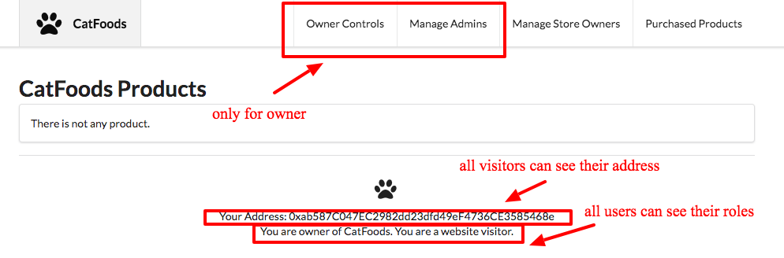
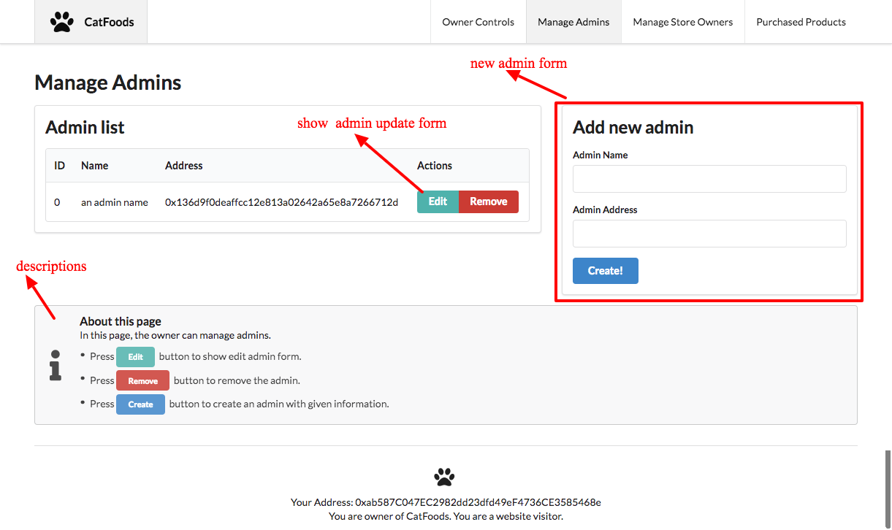
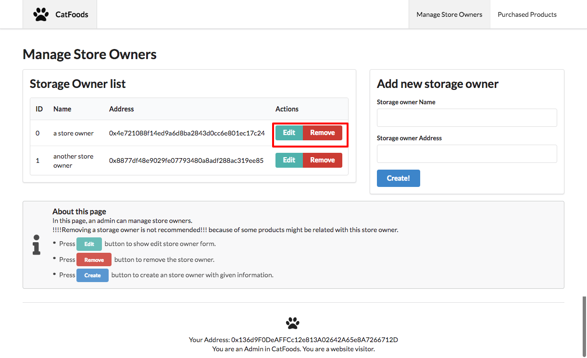
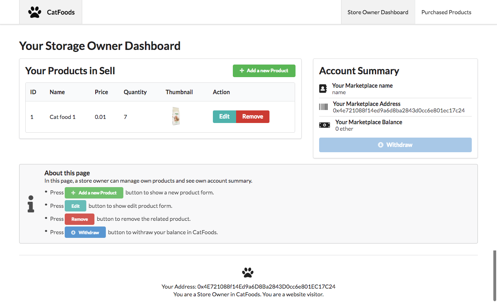
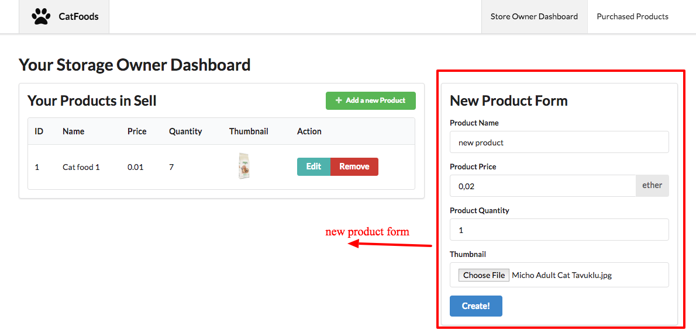
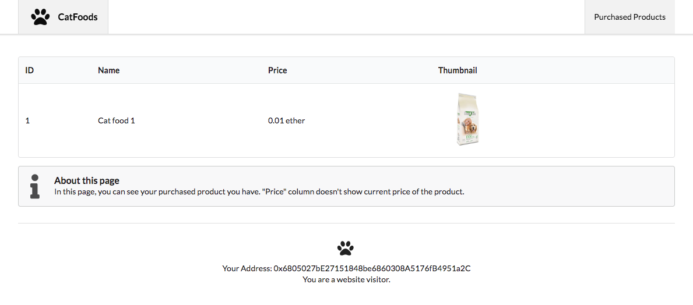
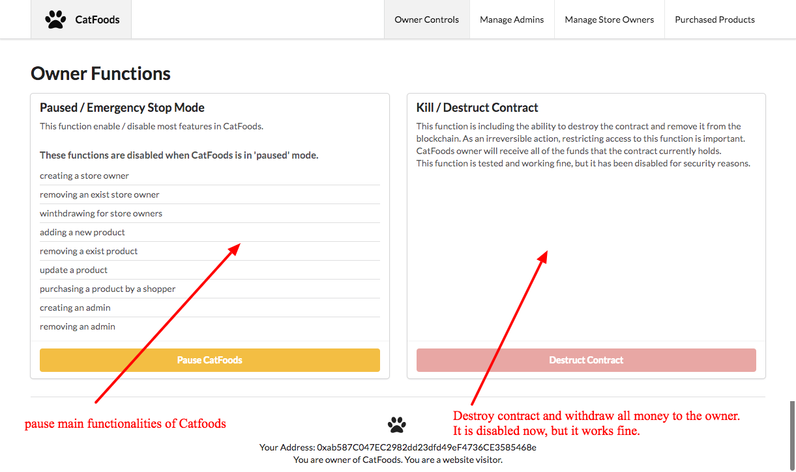

# CatFoods ScreenShots

An administrator opens the web app. This administrator is called Super Admin or Owner. The contract has been publish with its account address.
CatFoods reads the address and identifies that the user is Super Admin / Owner, showing them Super Admin only functions, such as managing store
owners and admins, enabling emergency stop mode, destructing contract.

## First visit of the owner.

## Managing admins

## Managing Store Owners

## Store Owner Dashboard

## New Product Form in Store Owner Dashboard

## Shoppers can see own purchased products

## The owners has some really dangerous options

